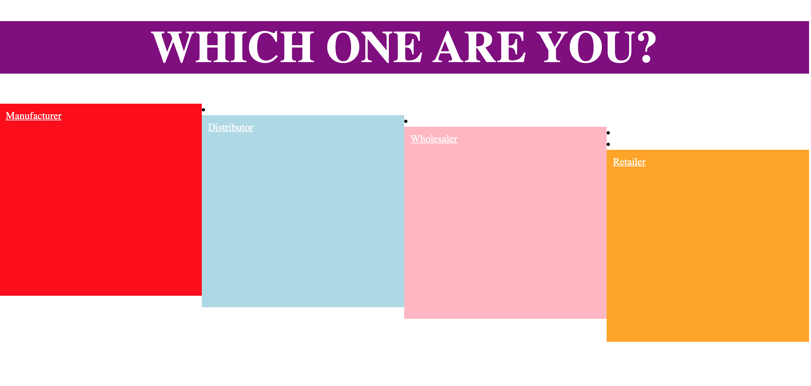

# README for beergame

Sprint 1

---

### Contributors

- Sherry Usman
- Nitesh Khatiwada

## File Structure
<pre>
    <code>
        \--static
            \--css
                |--styles.css
        \--templates
            |--base.html
            |--login.html
            |--register.html
            |--player_login.html
        \--tests
            |--test_sprint1.py
        |--app.py
    </code>
</pre>

## Overview --------------------- Let's remove for now!

For the second phase of this project, we created a website version of the beer game using basic HTML, CSS and Javascript for Frontend and Python and Flask for back-end.

The beer distribution game is an interactive software that simulates a simple supply-chain environment and illustrates important concepts such as the bull-whip effect.
This game consists of four different players: manufacturers, distributors, wholesalers and retailers, each participating in the buying and selling of beer till it reaches the customer. Consumers buy beer from their retailers who in turn buy beer from their wholesalers who in turn buy their beer from distributors and so on. Each player orders from their predecessor and delivers orders to their successor. Between successive orders and shipments there are factors such as information delay and time delay that stall progress. Furthermore, because beer is a commodity and thus has a price, factors such as inventory costs and back-order costs may hamper profit. Additionally, not being able to fulfill a demand results in negative inventory or backorder. The goal of each player is to avoid running out of beer stock, minimise total costs for everyone in the supply chain and also delivering all orders. Thus, players must adjust their orders depending on the demand and future incoming shipments to keep the inventory and back-orders in equilibrium.

## Built With

- Python3 with Flask Framework
- MySQL Database
- HTML, CSS

## Requirements

- Set up a virtual environment on Python 3.8.5
- Python Flask
- MySQL Server
- Flask-MySQLdb

Installations
<pre>
    <code>
        pip3 install flask  
        pip3 install flask-mysqldb
    </code>
</pre>

## Game Instructions

First setup the MySQL Server Connection. Navigate to the directory where <code> app.py </code> is kept. Run <code> python3 app.py </code>. This establishes the server and now navigate to <code> https://localhost:5000/login </code>. This is the landing page where instructor can login and register for the account.

----------------------------------------------------------------------------------------------------------------------------------------------------------

Open the website by clicking the welcomepage.html and decide whether you are an instructor or a student. Proceed to logging in on the next page or creating a new account on the next page.This button will redirect you to another page called depending on your identity. If you identify as an instructor you can proceed to the instructor dashboard which shows the list of games available and also the multiple functions provided by numerous buttons such as ‘print player passwords’, ‘update custom demand’ and so on. All these are meant to manipulate the settings of the games that are already created. The two additional buttons ‘create game’ and ‘delete game’ allow the instructor to create new games (as shown in figure 1) and delete games (as shown in figure 2).

If you identify as a player you can proceed to the list of games and then select a specific game out of the list. Then one has to choose between the different players on a page titled ‘which one are you?’ (whether they are a manufacturer, wholesaler, retailer or distributor) as shown in figure 1.

After choosing your role, the game begins and you are redirected to a player screen as shown in figure 2 (which shows the player screen of a manufacturer).

The first screen shows things personal to the player themselves such as the number of player inventory, amount ordered and amount shipped. As seen, the amount ordered can be imputed and modified. Furthermore, the second quadrant shows in table format the week, inventory/backorder, demand, incoming shipment and outgoing shipment of the manufacturer The 3rd quadrant shows information regarding other players which may or may not be available depending on the info-sharing button. The 4rth quadrant shows general settings of the game itself such as the holding cost and backorder cost, the upstream and downstream players ( players up and down the supply chain) and the information delay. The various buttons are used to plot the data as shown below. While these still contain only dummy values, they will be modified later on to better visualise the game progression.

